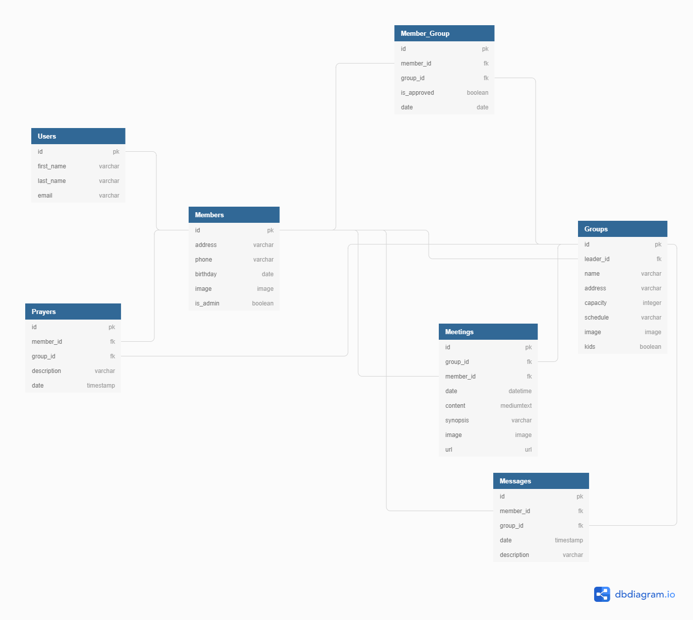

Small Connections is a back-end capstone project by [Brian Cravens](https://github.com/BrianCravens) for [Nashville Software School C40](https://github.com/nss-day-cohort-40)

## Brief Proposal

Churches that utilize small groups will be able to use this as a communications platform for their members to better communicate between one another.  New members can search for groups to join, and once in a group submit prayer requests as well as send messages to other members of the group.  Leaders can establish meetings to keep everyone up to date on when and where the meetings will be held.

## Project Definition

* Front End is written in React.
* Users can create and account, login, and logout.
* Ability to create new groups once you become an admin user.
* Leaders can accept incoming request to join their group.
* Leaders are able to monitor all communication and members.
* Leaders can add New Meetings as well as edit meetings.
* Leaders can pass leadership over to another current member.
* Users can create their profile and keep it updated as well as join/leave groups.
* Users can view the members of their group.
* Users can view all group messages, prayer requests, and meetings.

## Setup

1. Clone Small Connections by running the following command in your terminal: git clone https://github.com/BrianCravens/Small-Connections-API.git

1. Once cloned, you'll need to install the libraries and dependencies needed. Run the following command in your terminal: `npm install`

1. In the root of the project, run npm start to run Small Connections in your browser. This will open Small Connections in your browser in the following url: http://localhost:3000/

1. Set your browser view on a mobile view as this is designed as a mobile app.

1. This app does require running Small Connections Client Side. For further instructions, please visit: https://github.com/BrianCravens/SmallConnections.git

## Built With

- React
- JavaScript
- Bootstrap
- HTML
- CSS
- Django Rest API
- Python

## Database Diagram

## Wireframe
[Small Connections Wireframe](https://sketchboard.me/VCkbTFf8Frct)